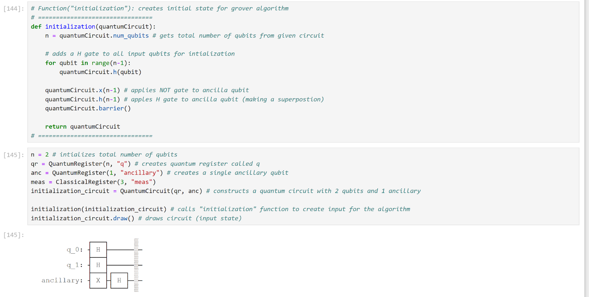

# Quantum-Computing-Algorithm-Project-Grover-s-Algorithm

Grover’s algorithm is essentially a quantum algorithm that takes in an unstructured set of N elements and finds a single element that is marked to be found. If this task was done by a classical computer, this process would be done in a O(N) timeframe, in contrast, a quantum computer utilizing this algorithm could find this element in the timeframe of O(√N). This algorithm completes this task by amplifying the marked state while suppressing the other states. In the example code that will be provided below, the quantum state ∣01⟩ will be the index of the value 2 found in array. The goal of the code is to apply Grover’s algorithm to find the index of the value 2.

The first step of my code is to create a function to prepare an input state for the algorithm (in this case I will be producing a 2-bit Grover search). We begin by applying a Hadamard gate to each qubit, thus creating a superposition for all possible states in the series of qubits. Afterwards, we create the ancilla bit. In the Grover algorithm, the oracle’s job is to identify the element that is needed to be searched by flipping the quantum phase of the marked state. An ancilla bit is used to help the oracle complete its tasks. The quantum gates must be reversible and the oracle can’t directly flip the phases, which is where the ancilla bit comes in. To initialize the ancilla bit, we simply add a NOT gate and H gate (i.e. putting it in the ∣−⟩ state). 
