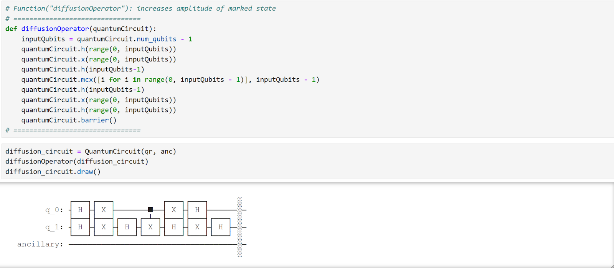

# Qauntum Computing Algorithm Project: Grover's Algorithm

Grover’s algorithm is essentially a quantum algorithm that takes in an unstructured set of N elements and finds a single element that is marked to be found. If this task was done by a classical computer, this process would be done in a O(N) timeframe, in contrast, a quantum computer utilizing this algorithm could find this element in the timeframe of O(√N). This algorithm completes this task by amplifying the marked state while suppressing the other states. In the example code that will be provided below, the quantum state ∣01⟩ will be the index of the value 2 found in array. The goal of the code is to apply Grover’s algorithm to find the index of the value 2.

The first step of my code is to create a function to prepare an input state for the algorithm (in this case I will be producing a 2-bit Grover search). We begin by applying a Hadamard gate to each qubit, thus creating a superposition for all possible states in the series of qubits. Afterwards, we create the ancilla bit. In the Grover algorithm, the oracle’s job is to identify the element that is needed to be searched by flipping the quantum phase of the marked state. An ancilla bit is used to help the oracle complete its tasks. The quantum gates must be reversible and the oracle can’t directly flip the phases, which is where the ancilla bit comes in. To initialize the ancilla bit, we simply add a NOT gate and H gate (i.e. putting it in the ∣−⟩ state). 

The next function to create would be the oracle function. As mentioned before, the oracle’s job is to mark the state that is targeted by applying a phase shift (to be more specific, it is flipping the sign of the amplitude associated with the target state that we are looking for). In simple mathematical terms, the oracle produces the following transformation: oracle = 1 (if x = xtarget or 0 (otherwise). The code below produces this phase flip by applying a negative sign to the amplitude of the target state via phase kickback. The X gate turns the ∣0⟩ state to ∣1⟩, matching the target condition that we want the oracle to recognize. The CCX gate flips the ancilla bit only if both q0 and q1 are ∣1⟩. This marks the solution by flipping the ancilla bit. After that, the phase shift from the first step is undone and q1 is brought back to its original state by applying a second X gate.

The final function in this algorithm is the diffusion operator. After the oracle has marked the target state, the diffusion operator applies a series of operations that increase the amplitude of the newly-marked state. Utilizing this diffusion operator will make the marked state more likely to be observed when it is time for the circuit to be measured. This can be shown in the mathematical operation D = 2∣ψ⟩⟨ψ∣ - I. D is the diffusion operator, ψ is the superposition state, and I is the identity matrix (the identity matrix allows a reflection to be produced, thus making sure the marked state’s amplitude is amplified. The combination of the oracle and diffusion operator archives the maximum probability for measuring the marked state in √N time.

After completing all the necessary functions, we can now implement Grover’s algorithm. After initializing the 2-bit quantum circuit, we iterate through it via a for-loop for how many qubits there are in the circuit. Within this for-loop, we run the oracle and diffusion operator combination to find the marked state. We clear the ancilla bit afterwards for reusability and optimization purposes. 

Running the qskit simulation, we see that the simulation gives a 100% probability of ∣001⟩. In the oracle function, we hardcoded that the marked state we want to find is ∣01⟩, The oracle changes the sign of the amplitude of the marked state, thus ½(∣00⟩+∣01⟩+∣01⟩+∣01⟩) becomes ½(∣00⟩-∣01⟩+∣01⟩+∣01⟩). Afterwards, the diffusion operator amplifies the negatives state and de-amplifies the others, thus giving us a 100% probability of the amplitude of the circuit being ∣001⟩.

If we run this on a real backend, we get similar results. I ran this on the Kingston quantum computer and it completed the workload in 4 seconds.

Grover’s algorithm is so significant because of simply how fast it is. It significantly speeds up the process of finding unstructured data searches while also utilizing much fewer steps/iterations than any classical algorithm could. There are an immense number of potential applications for Grover’s algorithm. Imagine how much faster a google search could be with Grover’s algorithm or how much more energy efficient hardware could be if this algorithm were to be implemented. Some questions I could pose would be how wide-spread this algorithm is used and have there been any attempts to make it faster (if that is even possible)?
